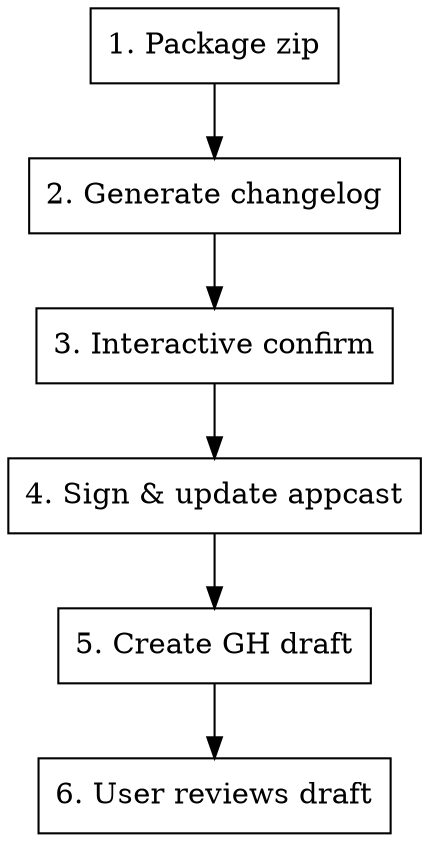

# Release Preparation

Prepare and publish a Mos release: package app → generate changelog → sign → create appcast → draft GitHub release.

## Inputs

| Input | Source |
|-------|--------|
| Mos.app path | User provides |
| Version / Build | Read from app's Info.plist |
| Channel | User specifies: `stable`, `beta`, or `alpha` |
| Signing key | macOS Keychain (Sparkle EdDSA) |

## Flow



### Step 1: Package Zip

```bash
bash .codex/skills/release-preparation/scripts/prepare_zip.sh /path/to/Mos.app [--channel beta]
```

Returns JSON with `zip_path`, `version`, `build`, `tag`, `zip_name`, `length`.

### Step 2: Generate Changelog

**This is AI work, not scripted.** Follow these rules:

1. Find last release commit:
   ```bash
   gh release list --repo Caldis/Mos --limit 1 --json tagName,isPrerelease
   gh release view <tag> --json targetCommitish
   ```
2. Get changes: `git log <last_commit>..HEAD --no-merges --oneline` excluding `website/`, `docs/`, `.issues-archive/`, `CLAUDE.md`, `LOCALIZATION.md`, `build/`, `dmg/`.
3. Categorize into: 新功能/New Features, 优化/Improvements, 修复/Fixes.
4. Find contributors: cross-reference `git log --format="%an"` with `gh api repos/.../commits/<sha> --jq '.author.login'`. Inline credit in the relevant section (e.g., "修复鼠标中键映射问题, 感谢 @GonzFC"), NOT in a separate section.
5. Match tone of `CHANGELOG.md` — bilingual (Chinese first, `---` separator, then English).
6. Write both formats:
   - **Markdown** → `~/Desktop/release-notes-{version}.md` (for GH release body)
   - **HTML** → `/tmp/changelog-{version}.html` (for appcast CDATA, `<h2>` + `<ul><li>`)

### Step 3: Interactive Confirm

**MUST use `AskUserQuestion` with `multiSelect: true`** to confirm changelog items by category. Never list items as text and ask user to type numbers.

After confirmation, sync any user edits from markdown back to HTML. Always keep both formats in sync.

### Step 4: Sign & Update Appcast

```bash
bash .codex/skills/release-preparation/scripts/update_appcast.sh <zip_path> /tmp/changelog-{version}.html [--tag TAG]
```

Uses Sparkle `sign_update` from Xcode DerivedData (reads EdDSA key from Keychain). If key missing, guide user:
```bash
# Find generate_keys tool
find ~/Library/Developer/Xcode/DerivedData -name "generate_keys" -not -path "*/checkouts/*" | head -1
# Import: generate_keys -f <key_file>
# Export: generate_keys -x <output_file>
```

### Step 5: Create GitHub Draft

```bash
bash .codex/skills/release-preparation/scripts/create_gh_draft.sh <tag> <zip_path> ~/Desktop/release-notes-{version}.md [--prerelease]
```

Add `--prerelease` for beta/alpha channels. This creates a **draft** — never publish without user approval.

### Step 6: Verify

After draft creation, verify:
```bash
gh release view <tag> --repo Caldis/Mos --json assets,tagName,isDraft
```
Confirm asset URL matches appcast `<enclosure url="...">`.

## Naming Conventions

| | Stable | Beta/Alpha |
|---|---|---|
| Zip | `Mos.Versions.{ver}-{YYYYMMDD.N}.zip` | `Mos.Versions.{ver}-beta-{YYYYMMDD.N}.zip` |
| Tag | `{ver}` | `{ver}-beta-{YYYYMMDD.N}` |
| Download URL | `.../download/{ver}/Mos.Versions...zip` | `.../download/{ver}-beta-.../Mos.Versions...zip` |

## Common Issues

| Problem | Fix |
|---------|-----|
| `sign_update` not found | Build project in Xcode first to fetch Sparkle SPM package |
| Signing key not in Keychain | Use `generate_keys -f <key_file>` to import |
| Appcast URL mismatch | Verify GH release tag matches appcast `<enclosure>` URL path |
| Changelog out of sync | Always edit markdown first, then regenerate HTML before updating appcast |
